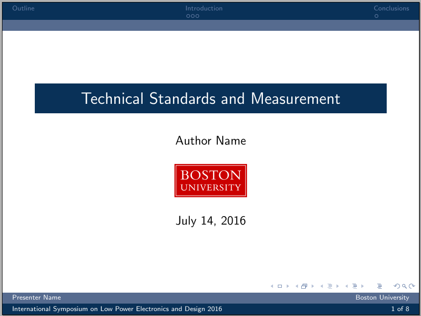

ISLPED Beamer Presentation Template
===================================



The make structure is a modification of the [MIT Beamer template](https://github.com/jtriley/mit-beamer). The original README is below.

**Note:** The install path in the original README points to the MIT repo.

Dependencies:
-------------
* latex-beamer class 3.0.7 (http://latex-beamer.sourceforge.net)
* texlive-latex 2008+ (http://www.tug.org/texlive/)
* automake (optional, used to run pdflatex commands)

Install:
--------
Install is simply downloading the code from github. Here we install mit-beamer to $HOME/mit-beamer::
```
    $ cd $HOME
    $ git clone https://github.com/zafartahirov/ISLPED-Presentation-Template.git
```

Generating the presentation:
----------------------------
- Customize `ISLPED-Presentation-Template/slides.tex` to your liking:
```
    $ emacs $HOME/ISLPED-Presentation-Template/slides.tex
```
- Then change to the ISLPED-Presentation-Template directory and run make to generate a presentation PDF:
```
    $ cd $HOME/ISLPED-Presentation-Template
    $ make
```
- You can then view the resulting pdf, named slides.pdf, in the 'out' directory:
```
    $ xpdf $HOME/ISLPED-Presentation-Template/out/slides.pdf
```
- You can also use make to do this automatically with either xpdf, okular, or acroread:
```
    $ make view-xpdf
    $ make view-okular
    $ make view-acroread
```
- The above `"make view-*"` commands will automatically build $HOME/ISLPED-Presentation-Template/out/slides.pdf if necessary


MIT - Beamer Presentation Template
----------------------------------

Latex Beamer presentation template derived from Andreas Kloeckner's brown-beamer template:

http://mathema.tician.de/software/brown-beamer

Dependencies:
-------------
* latex-beamer class 3.0.7 (http://latex-beamer.sourceforge.net)
* texlive-latex 2008+ (http://www.tug.org/texlive/)
* automake (optional, used to run pdflatex commands)

Install:
--------
Install is simply downloading the code from github. Here we install mit-beamer to $HOME/mit-beamer::
```
    $ cd $HOME
    $ git clone http://github.com/jtriley/mit-beamer.git
```

Generating the presentation:
----------------------------
- Customize mit-beamer/slides.tex to your liking:
```
    $ vim $HOME/mit-beamer/slides.tex
```
- Then change to the mit-beamer directory and run make to generate a presentation PDF:
```
    $ cd $HOME/mit-beamer
    $ make
```
- You can then view the resulting pdf, named slides.pdf, in the 'out' directory:
```
    $ xpdf $HOME/mit-beamer/out/slides.pdf
```
- You can also use make to do this automatically with either xpdf, okular, or acroread:
```
    $ make view-xpdf
    $ make view-okular
    $ make view-acroread
```
- The above `"make view-*"` commands will automatically build $HOME/mit-beamer/out/slides.pdf if necessary
